# 🏗️ Systentando Architecture Guides

> **Documentação interativa e visual da arquitetura do ecossistema Systentando**

Este repositório contém a documentação completa, diagramas interativos e guias de arquitetura do ecossistema Systentando. É uma ferramenta essencial para desenvolvedores, arquitetos e stakeholders entenderem a estrutura, padrões e melhores práticas do sistema.

## 🎯 Propósito do Projeto

O **Systentando Architecture Guides** é um hub centralizado que oferece:

- 📚 **Documentação Interativa**: Guias completos de arquitetura com exemplos práticos
- 🎨 **Sistema de Design**: Componentes padronizados e reutilizáveis
- 🔒 **Módulos de Segurança**: Implementações e padrões de segurança
- 🤖 **Agentes de IA**: Documentação de integração com IA
- 🏛️ **Padrões Arquiteturais**: SOLID, Clean Architecture e TDD
- 📊 **Diagramas Visuais**: Representações interativas da arquitetura

## 🚀 Quick Start

### Pré-requisitos

- Node.js 18+ 
- pnpm (recomendado) ou yarn
- WSL (Windows) ou terminal Unix

### Instalação e Execução

```bash
# 1. Clone o repositório
git clone <repository-url>
cd architecture-guides

# 2. Instale as dependências
pnpm install

# 3. Ou apenas iniciar normalmente
pnpm storybook
```

O Storybook estará disponível em: **http://localhost:6006**

### 🛠️ Comandos Disponíveis

```bash
# Desenvolvimento
pnpm storybook          # Inicia o Storybook em modo dev
pnpm build-storybook    # Build para produção

# Limpeza (em caso de problemas)
chmod +x cleanup.sh
./cleanup.sh           # Limpa cache e reinstala dependências
```

## 🏛️ Arquitetura do Projeto

```mermaid
graph TB
    A[📚 Architecture Guides] --> B[🎨 Design System]
    A --> C[🔒 Security Modules]
    A --> D[🤖 AI Agents]
    A --> E[🏗️ Backend APIs]
    A --> F[📊 Ecosystem Vision]
    
    B --> B1[Components]
    B --> B2[Design Tokens]
    B --> B3[Themes]
    
    C --> C1[Auth Flow]
    C --> C2[Security Guards]
    C --> C3[Client Libraries]
    
    D --> D1[Chatbot Collector]
    D --> D2[Agent Responses]
    D --> D3[AI Integration]
    
    E --> E1[Golang APIs]
    E --> E2[Node.js APIs]
    E --> E3[Python APIs]
    
    F --> F1[Conceptual Map]
    F --> F2[Visual Flow]
    F --> F3[Integration Overview]
    
    style A fill:#0ea5e9,stroke:#0369a1,color:#fff
    style B fill:#22c55e,stroke:#16a34a,color:#fff
    style C fill:#ef4444,stroke:#dc2626,color:#fff
    style D fill:#8b5cf6,stroke:#7c3aed,color:#fff
    style E fill:#f59e0b,stroke:#d97706,color:#fff
    style F fill:#06b6d4,stroke:#0891b2,color:#fff
```



## 📁 Estrutura do Projeto

```
architecture-guides/
├── 📚 docs/                          # Documentação principal
│   ├── 00-requisitos-tecnicos.md    # Padrões arquiteturais
│   ├── 01-fase-preparacao.md        # Metodologias iniciais
│   ├── 02-fase-planejamento.md      # Estruturação do trabalho
│   ├── 03-fase-execucao.md          # Implementação
│   ├── 04-fase-finalizacao.md       # Encerramento
│   └── 05-principios-norteadores.md # Valores e filosofia
├── 🎨 src/
│   ├── components/                   # Componentes reutilizáveis
│   │   ├── design-system/           # Sistema de design
│   │   ├── chatbot-collector/       # Coletor de chatbot
│   │   └── demo/                    # Componentes de demonstração
│   ├── stories/                     # Stories do Storybook
│   │   ├── ai/                      # Agentes de IA
│   │   ├── backend/                 # APIs e Backend
│   │   ├── chatbot/                # Chatbot
│   │   ├── design-system/          # Sistema de design
│   │   ├── ecosystem/              # Visão do ecossistema
│   │   └── security/               # Módulos de segurança
│   ├── styles/                      # Estilos globais
│   └── contexts/                    # Contextos React
├── 📊 diagrams/                      # Diagramas SVG
├── 🧪 templates/                    # Templates de código
└── 📖 storybook/                    # Configuração do Storybook
```

## 🎨 Módulos Principais

### 🎨 Design System
- **Componentes**: Button, Input, Card, etc.
- **Design Tokens**: Cores, tipografia, espaçamentos
- **Temas**: Suporte a modo claro/escuro
- **Acessibilidade**: WCAG 2.1 AA

### 🔒 Security Modules
- **Autenticação**: Fluxos de auth e autorização
- **Guards**: Proteção de rotas e recursos
- **Client Libraries**: Bibliotecas para integração
- **Métricas**: Monitoramento de segurança

### 🤖 AI Agents
- **Chatbot Collector**: Coleta e processamento de mensagens
- **Agent Responses**: Respostas inteligentes
- **Integração**: APIs e serviços de IA

### 🏗️ Backend APIs
- **Golang**: APIs de alta performance
- **Node.js**: APIs JavaScript/TypeScript
- **Python**: APIs de machine learning

### 📊 Ecosystem Vision
- **Mapa Conceitual**: Visão geral do ecossistema
- **Fluxos Visuais**: Diagramas de processo
- **Integração**: Visão de conectividade

## 🛠️ Desenvolvimento

### Padrões e Princípios

- ✅ **SOLID**: Princípios de design orientado a objetos
- ✅ **Clean Architecture**: Separação de responsabilidades
- ✅ **TDD**: Desenvolvimento orientado a testes
- ✅ **Component-Driven Development**: Desenvolvimento baseado em componentes

### Convenções

- **Nomenclatura**: PascalCase para componentes, camelCase para props
- **Estrutura**: Separação clara entre lógica e apresentação
- **Documentação**: Cada componente deve ter stories no Storybook
- **Testes**: Cobertura de testes para componentes críticos

## 🚨 Solução de Problemas

### Erro no MDX
```bash
# Verifique as importações
import { Meta, Story, Canvas, Description } from '@storybook/blocks';

# Use a sintaxe CSF correta
export default {
  title: 'Example/Component',
  component: YourComponent,
  tags: ['autodocs'],
};
```

### Erro de compilação JSX
- Verifique se arquivos JSX terminam com `.jsx`
- Confirme se as tags estão balanceadas
- Execute o script de limpeza: `./cleanup.sh`

### Problemas de Cache
```bash
# Limpeza completa
chmod +x cleanup.sh
./cleanup.sh
```

## 📚 Recursos Adicionais

- 📖 [Documentação Completa](./docs/)
- 🎨 [Sistema de Design](./DESIGN_SYSTEM.md)
- 🔒 [Módulos de Segurança](./SECURITY_MODULE_IMPLEMENTATION.md)
- 📊 [Visão do Ecossistema](./integration-overview.md)

## 🤝 Contribuindo

1. Fork o repositório
2. Crie uma branch para sua feature
3. Siga os padrões estabelecidos
4. Adicione stories para novos componentes
5. Submeta um Pull Request

## 📄 Licença

Este projeto está licenciado sob a [MIT License](LICENSE).

---

**Versão**: 1.0.0  
**Mantido por**: Equipe Systentando  
**Última atualização**: Setembro 2025
